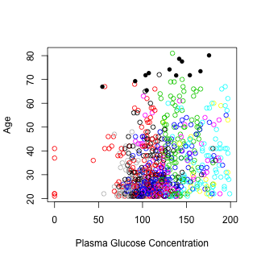
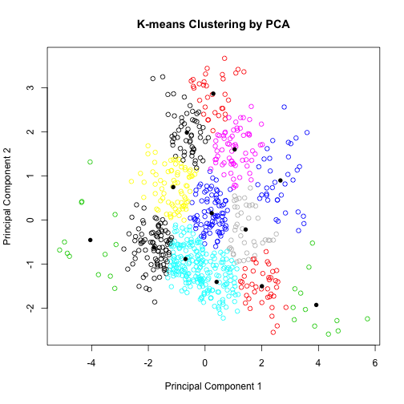

 K-Means Clustering on Pima Indians Diabetes Dataset using PCA
========================================================
date: 14-2-2016
transition: rotate

Introduction
========================================================
class: code

- Pima Indians Diabetes dataset is a dataset of 786 samples of diabetic and healthy individuals.
- Because there are 8 attributes, we'd like to reduce them using **Principal Component Analysis (PCA)** and cluster the resulting components to find any distinguished clusters.


```r
diabetes <- read.table("http://archive.ics.uci.edu/ml/machine-learning-databases/pima-indians-diabetes/pima-indians-diabetes.data",sep = ",",header=FALSE)
```

K-Means Clustering
========================================================

K-means is a method of classifying items into **k** groups by minimizing the sum of squared distances (Euclidean distances) between items and centroids.

```r
#clustering Plasma glucose concentration vs age with k=13
kclusters <- kmeans(  diabetes[,2:8], 13)
```


Principal Component Analysis (PCA)
========================================================
PCA is a dimensionality reducing algorithm that computes a weigted list of correlated attributes into two (or more) principal components.



 
Sources
========================================================
- To visit the application, go to [K-Means Clustering on Pima Indians Diabetes Dataset using PCA](najla.shinyapp.io/ClusteringPCADiabetes)

- The diabetes dataset is credited to [UCI machine learning database repository](http://archive.ics.uci.edu/ml/datasets/Pima+Indians+Diabetes).


<style>

/* slide titles */
.reveal h3 { 
  font-size: 60px;
  color: grey;
}

.code pre code {
  font-size: 25px;
}

</style>
